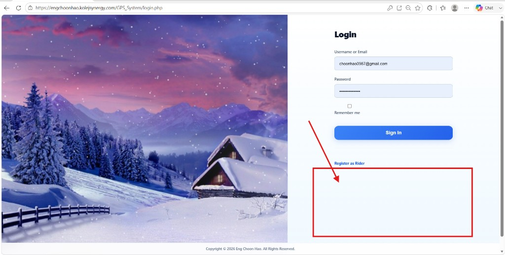
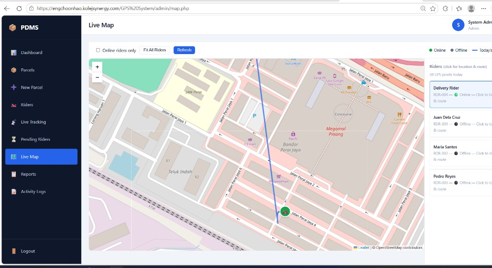
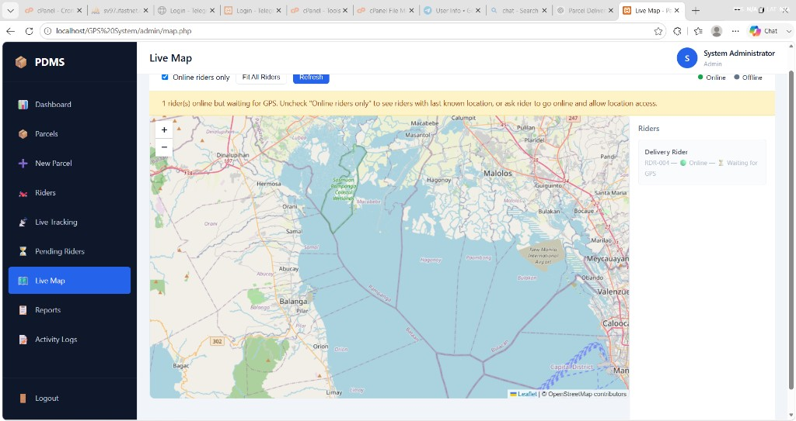
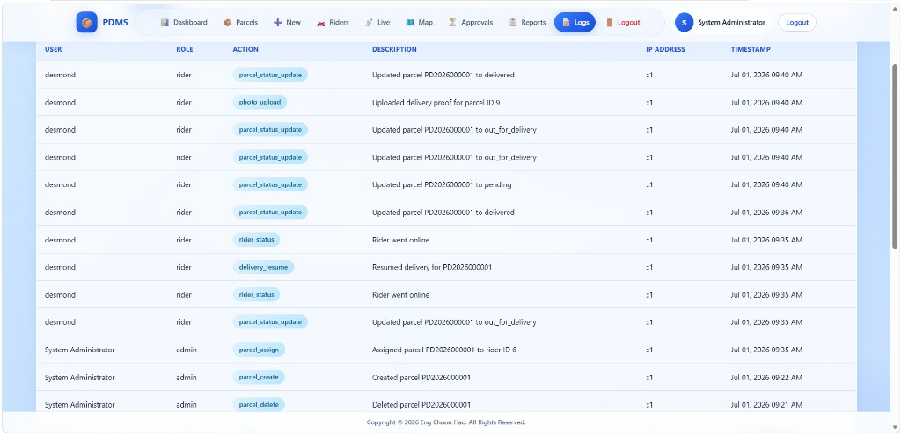
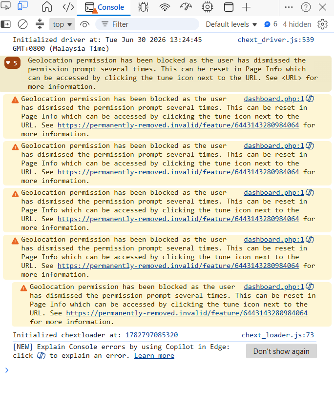
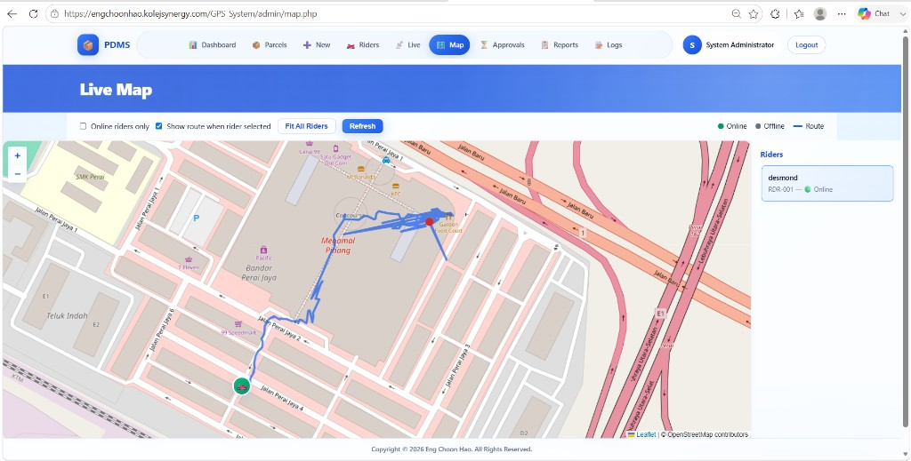

# 📦 **Parcel Delivery Management System (PDMS)**

A full-featured **Parcel Delivery Management System** built with **PHP, MySQL, JavaScript & Leaflet** to streamline parcel operations, track riders in real time, and manage deliveries with ease.

<p align="center">
  
  
  
  
  
</p>

---

## ✨ **Features**

- 📦 **Parcel Management**  
  Create, assign, update, and track parcels with clear status history.

- 🏍️ **Rider Operations**  
  Riders go online, receive assignments, navigate to destinations, and upload delivery proof.

- 📍 **Real-Time GPS Tracking**  
  Live map tracking with rider markers, route trails, and auto-follow on the rider map.

- 🗺️ **Live Map Dashboard**  
  Admins monitor online/offline riders, fit all locations, and inspect daily routes.

- 🔐 **Secure Authentication**  
  Role-based access for Admin & Rider, CSRF protection, Remember Me login, and session timeout.

- 📸 **Delivery Proof Uploads**  
  Capture and store delivery photos with parcel status updates.

- 📊 **Reports & Activity Logs**  
  Delivery reports, route distance insights, and detailed IP-aware activity logs.

- 📱 **PWA Support**  
  Installable web app prompt on the login page for faster mobile access.

---

## 🏗️ **Tech Stack**

| **Category** | **Technology** |
|---|---|
| 🖥️ **Frontend** | HTML5, CSS3, Vanilla JavaScript |
| 🔙 **Backend** | PHP 8+ |
| 🗄️ **Database** | MySQL / MariaDB |
| 🗺️ **Maps** | Leaflet.js + OpenStreetMap |
| 🧭 **Routing** | OSRM (driving routes) |
| 🔐 **Security** | Sessions, CSRF tokens, password hashing |
| 📱 **PWA** | Web Manifest + Service Worker |
| 🚀 **Hosting** | XAMPP (local) / cPanel (production) |

---

## 🚀 **Live Demo**

🌐 **Production:** [https://engchoonhao.kolejsynergy.com/GPS_System/](https://engchoonhao.kolejsynergy.com/GPS_System/)

### 🔑 **Demo Accounts**

| Role | Username | Password |
|---|---|---|
| 👑 **Admin** | `admin` | `admin123` |
| 🏍️ **Rider** | `user` | `user123` |

---

## 📁 **Project Structure**

```text
middleware/
├── admin/              # Admin dashboard, parcels, riders, map, reports, logs
├── rider/              # Rider dashboard, parcel detail, delivery tools
├── api/                # JSON APIs (login, location, parcels, health)
├── assets/             # CSS, JS, icons, images
├── config/             # App + database configuration
├── docs/screenshots/   # README project screenshots
├── functions/          # Auth, parcel, rider, helpers, reports
├── includes/           # Header, sidebar, bootstrap
├── sql/                # Database schema + seed data
├── uploads/            # Delivery proof photos
├── manifest.php        # PWA manifest
├── sw.js               # Service worker
├── login.php
└── register.php
```

---

## 🛠️ **Getting Started**

### 1️⃣ Requirements
- XAMPP / PHP 8+
- MySQL
- Modern browser (Chrome / Edge recommended for PWA)

### 2️⃣ Installation
```bash
# Clone the repository
git clone https://github.com/NakiriFubuki/middleware.git
cd middleware

# Import database
# Open phpMyAdmin → Import → sql/schema.sql

# Configure database (optional local overrides)
# Copy config/config.local.php.example → config/config.local.php
```

### 3️⃣ Run Locally
1. Place the project in `C:\xampp\htdocs\middleware`
2. Start **Apache** + **MySQL** in XAMPP
3. Open: `http://localhost/middleware/login.php`

---

## 🖼️ **Project Screenshots**

<p align="center">
  
  
</p>

<p align="center">
  
  
</p>

<p align="center">
  
  
</p>

---

## 🧭 **Core Workflows**

1. 👑 Admin creates a parcel and assigns a rider  
2. 🏍️ Rider goes online and starts delivery  
3. 📍 GPS points are recorded along the route  
4. 📸 Rider uploads proof and marks delivered  
5. 📊 Admin reviews routes, reports, and activity logs  

---

## 🤝 **Contributing**

Contributions are welcome!  
Please read **[CONTRIBUTING.md](CONTRIBUTING.md)** before opening a Pull Request.

---

## 📝 **License**

This project is licensed under the **[MIT License](LICENSE)**.

---

✨ Feel free to explore, contribute, and enhance the project! 🚀

⭐ If you find this project helpful, don't forget to **star** the repository! 🌟

💻 Developed by **Eng Choon Hao**
